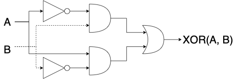
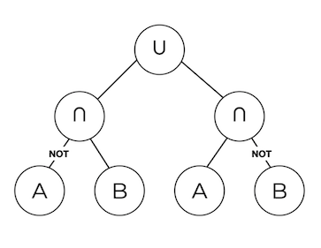

# Genetic Programming for Combinatorial Logic Circuits

This repository contains files for my course project for *ECE720 Metaheuristic Optimization* at the University of Alberta (Fall 2020).

Combinatorial logic circuits can be represented as binary trees, and binary trees can be "evolved" through genetic programming (GP).[^1]

**XOR gate as a combinatorial logic circuit**

**XOR gate as a binary tree**

## Documentation
- [`docs/report.pdf`](docs/report.pdf)
- [`docs/slides.pdf` ](docs/slides.pdf)

## Code
### Python version
- Original version
- Generate circuits and evolve them with GP
- "Visualize" the circuits as Boolean expressions
- Several examples of how to use this code given in Jupyter Notebooks
- See `py/` directory

### JavaScript version
- Re-implemented some of the circuit generation code in JavaScript
- Added some basic visualization code using the HTML5 \<canvas\>
- See `js/` directory

## Todo
- Create visualization of generated circuits (kind of done with JavaScript but could be way better)
- Add pruning operations to remove obvious useless gate/input combinations
- Add encapsulation operation, maybe that will help maintain sub-circuits in the search process
- Add reducing operations to replace patterns of gates with a new black box "gate"
- Optimize the code; it is pretty slow at the moment and I think it could be vectorized

[^1]: Chapter 4, [*Global Optimization Algorithms: Theory and Application*](https://archive.org/details/Thomas_Weise__Global_Optimization_Algorithms_Theory_and_Application), T. Weise, 2013.
